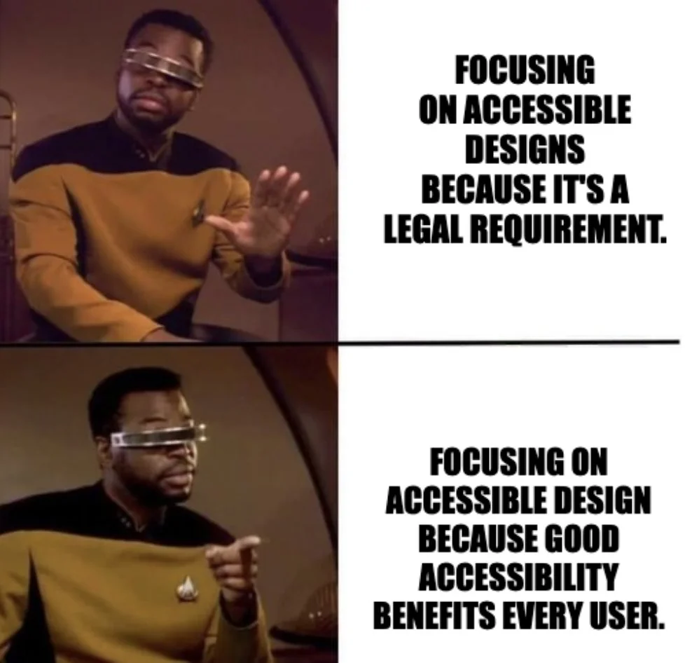

# ACESSIBILITY CHALLENGE

My old BeCode project was transformed in an accessibility nightmare! As an exercise, you need to remediate all accessibility issues on the website. Use the knowledge you acquired on the workshop and consult the [slides]() when necessary. Try to link each issue to a [WCAG 2.1 success criteria](https://www.w3.org/TR/WCAG21/#perceivable), to consolidate your understanding of guidelines and standards.

### IF YOU ARE STUCK...

Here are a list of the success criterias on which you can find issues on this website. A criteria can have multiple issues associated with it.

- 1.1.1 Non-text Content
- 1.3.1 Info and Relationships
- 1.3.5 Identify the Input Purpose
- 1.4.1 Use of Colour
- 1.4.3 Contrast (minimum)
- 1.4.11 Non-text Contrast
- 2.4.2 Page Title
- 2.4.3 Focus Order
- 2.4.4 Link purpose (in context)
- 2.4.6 Headings and Labels
- 3.1.1 Language of Page
- 3.3.2 Labels or Instructions
- 3.3.1 Error Identification
- 3.3.3 Error Suggestion
- 4.1.3 Status Messages

### IF YOU ARE THE FLASH...

Here are some extra challenges for you!

- Currently the website is using the default focus indicator. Style one on your own and remember, focus indicators should have at least 3:1 contrast with the background and with the element itself.
- When the mouse hovers over photos on the gallery page, additional content becomes visible that covers other content. Users cannot hide the content again without moving the mouse pointer or the keyboard focus. Users should be able to hide the content with a very simple action such as pressing the Escape key. Try to implement that (you will need some Javascript).
- Implement a skip link on the page.
- The “Latest Umbrellas” section is currently a list. Try to implement it as an accordion widget, using [details & summary elements](https://developer.mozilla.org/en-US/docs/Web/HTML/Element/details), which are accessible by default, or using the [W3C accordion widget pattern](https://www.w3.org/WAI/ARIA/apg/patterns/accordion/).
- Research the [Popover API documentation](https://developer.mozilla.org/en-US/docs/Web/API/Popover_API). Try to implement it somewhere in the page, like the form submission message. You will need some Javascript for it.
- Now try to implement a [modal dialog](https://developer.mozilla.org/en-US/docs/Web/HTML/Element/dialog), like a cookie consent overlay, an alert or any other idea you might have. You will need some Javascript for it.

  
SPOILERS!

  
  Want to check if you found everything? Here is a list with the issues and some explanation to consolidate your accessibility knowledge.

  ##### 1.1.1 Non-text Content
    - 3 images without alt text on umbrellas.html (one of them is using a title attribute)
    - 2 incorrect alternative text (they are not descriptive of the image)
  ##### 1.3.1 Info and Relationships
    - On the umbrellas.html page, there is a paragraph with class=”disclaimer-sr-only” that is hidden on CSS with display: none. This CSS hides all the information inside the element not only visually but also for screen readers. For this reason, this is not an appropriate method of making information available for screen reader users only.
        How to solve: Adjust the CSS to hide content visually in a correct way, so that it does not get hidden for screen readers:
        ´´´
            .disclaimer-sr-only {
                position: absolute;
                height: 1px;
                width: 1px;
                clip: rect(1px, 1px, 1px, 1px);
                clip-path: inset(50%);
                margin: -1px;
                overflow: hidden;
                padding: 0;
                border: 0;
                white-space: nowrap;
            }
        ´´´
    - This paragraph should be a <h4>: 
About Me

    - “Latest Umbrellas” on index.html should be a <ul> element. Consequently, the immediate children should be <li> items. Example:
    ´´´
        <ul class=”cities”>
            <li>
                <h4>Rio de Janeiro</h4>
                
The umbrella hunt took us…

                

            </li>
            <li>..</li>
        </ul>
´´´
    - The sentence on the footer should be a 
, not a <h5> (there is no content below to what it serves as a heading).
    - On the <header>, subheadings should not be marked up as a lower level heading, but as a <hgroup> element. Example:
    ´´´
        <header>
            <hgroup>
                <h1>Where Did I Left My Umbrella?</h1>
                
A Travel Quest Around the World

            </hgroup>
        </header>
´´´
    - The label “Email” is not linked with the input field. You can linked using the for attribute or wrapping the label element around the input field.
    - Bonus: use aria-current for the current item on the site navigation (tip: they have a class=”current”). You can use the attribute aria-current to tell assistive technologies that element represents the current page. This makes it easier for users of these technologies to understand where they are on the site and how to navigate to other pages.
  ##### 1.3.5 Identify the Input Purpose
    - Form fields asking for user data do not have autocomplete attributes. These make it easier and faster for people to fill in their data, especially for people with dyslexia.For the appropriate autocomplete attribute values, you can consult Input Purposes for User Interface Components in the Web Content Accessibility Guidelines (WCAG).
  ##### 1.4.1 Use of Colour
    - The links on the page are indistinguishable from the other text. Use text-decoration: underline on CSS. WCAG technique G183 allows links that are not underlined if they meet the following criteria: 1) the link colour has a contrast ratio of at least 3:1 with the colour of the surrounding text and, 2) the link colour has a contrast ratio of at least 4.5:1 with its own background. And remember to also style hover and focus state!
  ##### 1.4.3 Contrast (minimum)
    - The text on the <aside> element has insufficient contrast with the background. Only one of the assigned colours on the CSS has enough contrast, pick this one! You can use the WebAIM Contrast Checker tool.
  ##### 1.4.11 Non-text Contrast
    - The button on the Contact form has insufficient contrast with the background. Again, only one of the assigned colours on the CSS has enough contrast, pick this one!
  ##### 2.4.2 Page Title
    - No title attribute on index.html
    - Bonus: page title could be more descriptive on umbrellas.html
  ##### 2.4.3 Focus Order
    - A number of elements have 1) tabindex attribute with a positive value, or 2) tabindex=”0” when they are not an interactable element. Elements with positive tabindex value receive focus before all other keyboard-focusable elements without a tabindex attribute. And remember, only interactable elements should be focusable using the keyboard.
    - Some elements on the Umbrellas page were removed from the focus order using a negative tabindex value.
  ##### 2.4.4 Link purpose (in context)
    - The link on the <aside> element has inappropriate text (just characters as an emoji). Provide it with good text or, if you want to keep as it is, can you find a different solution to label this link?
  ##### 2.4.6 Headings and Labels
    - The map used on the Contact page is an <iframe> and has no accessible name.You can provide one using the title attribute.
  ##### 3.1.1 Language of Page
    - No lang attribute on umbrellas.html
    - Wrong lang value on contact.html
  ##### 3.3.2 Labels or Instructions
    - The <textarea> form field has no visible label. Don't forget to associate the label with the corresponding field.
    - Required fields are not marked as such. Is the “*” symbol enough to indicate requirement?
  ##### 3.3.1 Error Identification
    - When an input error is detected in the form, the fields with the error are not identified and the error is not described in text. As a consequence, screen reader users (and other users) may find it difficult to correct the input error. Style the inputs with error to make it clear which fields are incorrect. Provide text that describes the nature of the error, preferably custom to each field. Add the attribute aria-invalid="true" to the input field that has an error. Some of these steps will need Javascript.
  ##### 3.3.3 Error Suggestion
    - For the email form field, generate a different error message when the email is not in the correct format. Provide suggestions on how to correct it (or show an example).
  ##### 4.1.3 Status Messages
    - The error messages must have the attribute role="alert".
    - When successfully submitting the form, the content of the page is updated dynamically. Sighted users will see the confirmation message, but screen reader users will not get feedback after they submitted the form. Use an ARIA live region on the heading of the confirmation message

&nbsp;  
&nbsp;  

